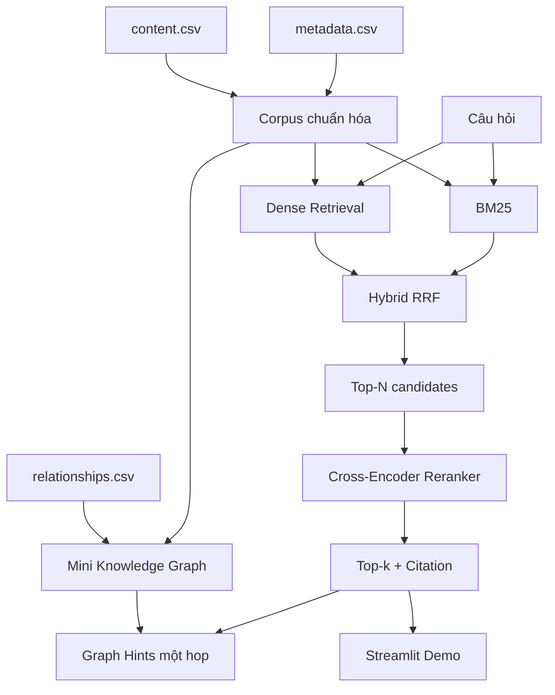

# BÁO CÁO TỔNG KẾT BUỔI 14

**Ngày tổng kết:** 19/08/2026  
**Workspace:** `C:\RAG\Knowledge Graph mini`  
**Working root:** `C:\RAG\Knowledge Graph mini\buoi_14`  
**Lab session Neo4j:** `buoi_14`  
**Trạng thái tổng thể:** **READY FOR DEMO: YES**

## 1. Phạm vi thực hiện

Buổi 14 đã hoàn thành toàn bộ Prompt 0 đến Prompt 8:

| Prompt | Nội dung | Trạng thái |
|---:|---|---|
| 0 | Kiểm tra project, môi trường và dữ liệu | COMPLETE |
| 1 | Chuẩn hóa corpus và citation metadata | COMPLETE |
| 2 | Baseline BM25 và Dense Retrieval | COMPLETE |
| 3 | Hybrid Search bằng RRF | COMPLETE |
| 4 | Neural Reranking sau Hybrid | COMPLETE |
| 5 | Evaluation chung cho bốn cấu hình | COMPLETE |
| 6 | Mini Knowledge Graph trên Neo4j | COMPLETE, LOADED |
| 7 | Unified Retrieval API và Graph Hints | COMPLETE |
| 8 | Streamlit Demo | COMPLETE, RUNNING |

## 2. Kiến trúc đã hoàn thành



Pipeline retrieval và graph dùng chung định danh `document_id` và `chunk_id`, nhờ đó citation và Graph Hints không bị mất qua các tầng.

---

## 3. Prompt 0 - Project Pre-check

### Dữ liệu nguồn đã đọc trực tiếp

| File | Dòng dữ liệu | Số cột | Duplicate row | Encoding |
|---|---:|---:|---:|---|
| `metadata.csv` | 15 | 17 | 0 | UTF-8 |
| `content.csv` | 15 | 2 | 0 | UTF-8 |
| `relationships.csv` | 8 | 4 | 0 | UTF-8 |

### Kiểm tra tính toàn vẹn

- `metadata.id` unique: 15/15.
- `content.id` unique: 15/15.
- ID metadata và content khớp: 15/15.
- Relationship orphan endpoint: 0.
- Relationship self-loop: 0.
- Duplicate relationship edge: 0.
- Không có code pipeline cũ trong `buoi_14/` trước khi bắt đầu.
- Không phát hiện thao tác phá dữ liệu trong code dự án.

### Môi trường

- Python: `3.11.2`.
- Virtual environment: `buoi_14/.venv`.
- pandas: `2.2.3`.
- `pip check`: không có dependency bị hỏng.
- VS Code/Pylance dùng đúng interpreter của `buoi_14/.venv`.

### Kết luận Prompt 0

```text
Safe to continue: YES
```

Báo cáo chi tiết: `outputs/inspection_report.md`.

---

## 4. Prompt 1 - Chuẩn hóa corpus

### Sản phẩm

- Script: `scripts/prepare_corpus.py`.
- Output: `data/processed/chunks_normalized.csv`.

### Kết quả chạy thật

```text
Total chunks: 1242
Documents: 15
Chunks missing text: 0
Duplicate rows: 0
Duplicate chunk IDs: 0
Duplicate texts: 44
```

44 đoạn text trùng được giữ vì có thể thuộc văn bản/citation khác nhau; không tự xóa dữ liệu nghiệp vụ.

### Corpus đầu ra

Schema gồm:

```text
chunk_id
document_id
text
source_file
title
document_number
document_type
chapter
section
article
effective_date
issue_date
status
issuing_authority
source_url
```

Các đặc điểm đã xác minh:

- HTML được parse thành plain text.
- Không còn thẻ HTML retrieval chính.
- Giữ mã văn bản, số điều, chương và mục.
- Mỗi chunk tối đa 2.000 ký tự.
- 1.242/1.242 `chunk_id` unique.
- 15/15 văn bản có chunk.
- Citation metadata lấy từ dữ liệu thật, không bịa metadata.

---

## 5. Prompt 2 - BM25 và Dense baseline

### BM25

- Library: `rank-bm25==0.2.2`.
- Tokenizer Unicode giữ:
  - tiếng Việt;
  - số điều;
  - mã có `/`, `-`, `.`;
  - ví dụ `01/2014/TT-NHNN` là một token có ý nghĩa lexical.

### Dense Retrieval

- Model: `thuannc/vi-distilled-msmarco-MiniLM-L12-cos-v5`.
- Thiết bị: CPU.
- Vector: 384 chiều, normalize trước cosine similarity.
- Cache document embeddings: `cache/dense_embeddings_9c5ee5216ba5bdb7.npz`.
- Cache được tái sử dụng, không encode lại corpus cho mỗi query.

### Schema chung

```text
rank
chunk_id
document_id
text
retrieval_score
retrieval_method
citation
```

### Quan sát thực tế

- Query mã `01/2014/TT-NHNN`: BM25 tìm đúng văn bản ở toàn bộ top đầu; Dense xử lý mã thuần kém.
- Query paraphrase “Muốn mở một ngân hàng mới…”: BM25 bị kéo sang “mở/chìa khóa”, Dense tìm đúng nhóm hồ sơ cấp phép tốt hơn.
- Query kết hợp mã và nội dung `41/2016/TT-NHNN`: cả hai tìm đúng văn bản nhưng ưu tiên passage khác nhau.

Báo cáo ví dụ: `outputs/retrieval_examples.md`.

---

## 6. Prompt 3 - Hybrid Search bằng RRF

### Cấu hình

- Tái sử dụng đúng BM25 và Dense baseline.
- Cùng đọc `data/processed/chunks_normalized.csv`.
- `candidate_k=20` cho mỗi retriever.
- `top_k=5`.
- RRF constant: `k=60`.

Công thức với một candidate:

$$
\operatorname{RRF}(d)=\sum_{r\in\{BM25,Dense\}}\frac{1}{60+\operatorname{rank}_r(d)}
$$

Không cộng trực tiếp raw BM25 score với cosine score.

### Output

```text
final_rank
chunk_id
document_id
bm25_rank
dense_rank
rrf_score
text
citation
```

### Validation

- Candidate chỉ xuất hiện ở một retriever vẫn được giữ.
- Không duplicate chunk.
- Citation không bị mất.
- Runtime validation trên 20 kết quả: 20 chunk unique.
- Trong một phép kiểm tra: giữ 7 BM25-only candidates và 10 Dense-only candidates.

### Kết luận thực tế

- Hybrid cải thiện so với Dense ở query mã chính xác.
- Hybrid cân bằng hai tín hiệu ở query mixed.
- Hybrid chưa tốt ở một số query semantic vì overlap hạng thấp có thể tạo false consensus.

---

## 7. Prompt 4 - Neural Reranking

### Model

- Cross-Encoder: `cross-encoder/mmarco-mMiniLMv2-L12-H384-v1`.
- Multilingual, chạy CPU.
- Model cache cục bộ khoảng 470 MB.
- Đây là neural reranker thật, không phải fallback.

### Pipeline

```text
Question
→ Hybrid candidate_k=20
→ Cross-Encoder chấm 20 candidates
→ top_k=5
```

Reranker không chạy trên toàn bộ 1.242 chunk.

### Output

```text
final_rank
chunk_id
document_id
hybrid_rank
hybrid_score
rerank_score
text
citation
```

### Kết quả chạy thật

- Terminal in đủ `BEFORE RERANK` và `AFTER RERANK`.
- Query semantic: loại hai false-consensus Hybrid khỏi top 5; đưa passage đúng về hồ sơ ngân hàng từ Hybrid rank 16 lên rank 2.
- Vẫn còn false positive bảo hiểm ở rank 1 của query semantic.
- Query mixed: ưu tiên passage đầy đủ hơn heading, nhưng có trường hợp Điều 6 rơi khỏi top 5.

Kết luận: reranking thay đổi ranking thật nhưng không được giả định luôn cải thiện nếu chưa đánh giá bằng gold relevance.

---

## 8. Prompt 5 - Evaluation

### Bộ câu hỏi

- File: `data/eval/questions.csv`.
- Tổng: 9 câu.
- `EXACT_KEYWORD`: 3.
- `SEMANTIC`: 3.
- `MIXED`: 3.
- Gold chunk được xác minh từ nội dung corpus trước khi chạy retrieval.
- Không thay gold sau khi xem kết quả.

### Protocol

- Cùng corpus.
- Cùng bộ câu hỏi.
- Cùng `top_k=5`.
- Hybrid/Rerank cùng `candidate_k=20`.
- Không bỏ query thất bại.
- Runtime errors: 0.
- Tổng evaluation rows: 36 = 9 câu × 4 method.

### Overall metrics

| Method | Hit@1 | Hit@3 | Hit@5 | MRR |
|---|---:|---:|---:|---:|
| BM25 | 0.556 | 0.667 | 0.778 | 0.639 |
| Dense | 0.111 | 0.222 | 0.222 | 0.148 |
| Hybrid | 0.222 | 0.222 | 0.556 | 0.306 |
| Hybrid + Rerank | 0.556 | 0.667 | 0.778 | 0.639 |

### Nhận xét

- BM25 mạnh nhất trên bộ corpus pháp lý giàu thuật ngữ chính xác này.
- Dense baseline hiện yếu hơn rõ rệt.
- Hybrid RRF không vượt BM25 tổng thể và đôi khi làm loãng exact match.
- Hybrid + Rerank phục hồi metrics về ngang BM25 tổng thể.
- Reranking đổi thứ tự top 5 ở 9/9 câu hỏi.
- Failure cases nổi bật: `E03`, `M02` và một số Dense misses.

### Giới hạn evaluation

- Mỗi câu chỉ có một `expected_chunk_id`.
- Passage khác có thể vẫn liên quan nhưng bị tính là miss.
- Bộ 9 câu chưa đại diện toàn bộ miền dữ liệu.
- Metrics retrieval không đo độ đúng của câu trả lời LLM.

Outputs:

- `outputs/retrieval_comparison.csv`.
- `outputs/evaluation_report.md`.

---

## 9. Prompt 6 - Mini Knowledge Graph

### Neo4j

- Database: `kb-hops`.
- Lab marker: `lab_session = "buoi_14"`.
- Trạng thái: `LOADED`.
- Loader: parameterized Cypher và `MERGE`.
- Không hard-code password.
- Không có global delete query.
- Nạp lại lần hai giữ nguyên counts, xác nhận idempotent.

### Ontology

```text
(:VanBan)-[:CONTAINS]->(:DieuKhoan)
(:DieuKhoan)-[:NEXT]->(:DieuKhoan)
```

Quan hệ văn bản chỉ lấy từ `relationships.csv`:

```text
CAN_CU
HOP_NHAT
SUA_DOI_BO_SUNG
THAY_THE
VAN_BAN_BO_SUNG
```

### Counts thực tế trong Neo4j

#### Nodes

| Label | Count |
|---|---:|
| `VanBan` | 15 |
| `DieuKhoan` | 1.242 |
| **Tổng** | **1.257** |

#### Relationships

| Type | Count |
|---|---:|
| `CONTAINS` | 1.242 |
| `NEXT` | 1.227 |
| `CAN_CU` | 4 |
| `HOP_NHAT` | 1 |
| `SUA_DOI_BO_SUNG` | 1 |
| `THAY_THE` | 1 |
| `VAN_BAN_BO_SUNG` | 1 |
| **Tổng** | **2.477** |

### Quality checks

- `DieuKhoan` không có `CONTAINS`: 0.
- Isolated session nodes: 0.
- Node thiếu `lab_session`: 0.
- Relationship thiếu `lab_session`: 0.
- Relationship provenance được giữ từ `relationships.csv`.

### Demo query đã xác minh

```text
44209-chunk-0001
→ 44209-chunk-0002
→ 44209-chunk-0003
```

Ví dụ quan hệ văn bản:

```text
163441 -[:THAY_THE]-> 112025
112924 -[:CAN_CU]-> 95652
6e689cd0-... -[:HOP_NHAT]-> 173695
```

Files:

- `scripts/load_mini_kg.py`.
- `cypher/schema.cypher`.
- `cypher/demo_queries.cypher`.
- `outputs/kg_build_report.md`.

---

## 10. Prompt 7 - Unified Retrieval và Graph Hints

### API chung

```python
from src.retrieval import retrieve

results = retrieve(question, method, top_k=5)
```

Method hỗ trợ:

```text
bm25
dense
hybrid
hybrid_rerank
```

Schema bắt buộc mọi method:

```text
rank
chunk_id
document_id
text
score
citation
retrieval_method
```

Hybrid giữ thêm:

```text
bm25_rank
dense_rank
rrf_score
```

Hybrid + Rerank giữ thêm:

```text
hybrid_rank
hybrid_score
rerank_score
```

### Runtime validation

Cả bốn method được gọi tuần tự qua cùng một pipeline và trả schema hợp lệ, citation không rỗng, chunk unique.

Ví dụ top-1 cho cùng query `41/2016/TT-NHNN`:

| Method | Top-1 chunk |
|---|---|
| BM25 | `117310-chunk-0053` |
| Dense | `117310-chunk-0051` |
| Hybrid | `117310-chunk-0020` |
| Hybrid + Rerank | `117310-chunk-0001` |

### Graph Hints

- Hiển thị `document_id`.
- Hiển thị `chunk_id`.
- Truy vấn quan hệ `VanBan` trực tiếp theo chiều vào/ra.
- Chỉ một hop, không phải Graph RAG phức tạp.
- Nếu Neo4j tắt, retrieval vẫn chạy và Graph Hints báo trạng thái riêng.

Ví dụ:

```text
document_id=44209
chunk_id=44209-chunk-0002
← SUA_DOI_BO_SUNG 169221
```

CLI: `scripts/query_demo.py`.

---

## 11. Prompt 8 - Streamlit Demo

### App

- File: `app.py`.
- Tiêu đề: `RAG Hybrid Search — Buổi 14`.
- Streamlit: `1.48.1`.
- Trạng thái tại thời điểm tổng kết: đang chạy trên port `8501`.

URL đã xác minh:

```text
Local URL: http://localhost:8501
Network URL: http://192.168.1.198:8501
```

### Chức năng

- Ô nhập `Câu hỏi`.
- Segmented control:
  - BM25;
  - Dense;
  - Hybrid;
  - Hybrid + Rerank.
- Chọn Top-k: 1, 3, 5, 10.
- Nút `Tìm kiếm`.
- Mỗi result hiển thị:
  - rank;
  - chunk ID;
  - document ID;
  - score;
  - retrieval method;
  - citation;
  - text;
  - component ranks/scores nếu có.
- Hybrid + Rerank hiển thị `BEFORE RERANK` và `AFTER RERANK`.
- Graph Hints hiển thị quan hệ Neo4j trực tiếp.
- Không render toàn bộ Knowledge Graph trong Streamlit.

### Browser validation

- Exact keyword + BM25: top-1 `44209-chunk-0002`.
- Semantic + Dense: chạy thành công và trả top-1 semantic đã ghi nhận.
- Hybrid + Rerank: đủ 5 result, Before/After, citation và Graph Hints.
- Neo4j status trong app: `Neo4j ready`.
- Không có traceback sau sửa lỗi tương thích Streamlit.
- Desktop: không horizontal overflow.
- Mobile 390×844: không horizontal overflow; controls tự xuống dòng.
- Text và citation được HTML escape trước khi render.

### Chạy và dừng

Từ `buoi_14/`:

```powershell
& ".\.venv\Scripts\python.exe" -m streamlit run app.py
```

Dừng server bằng `Ctrl+C` trong terminal đang chạy Streamlit.

---

## 12. Sản phẩm bàn giao

### Scripts

```text
scripts/
├── prepare_corpus.py
├── baseline_retrieval.py
├── hybrid_search.py
├── rerank.py
├── compare_retrieval.py
├── load_mini_kg.py
└── query_demo.py
```

### Source modules

```text
src/
├── corpus.py
├── bm25_retriever.py
├── dense_retriever.py
├── hybrid_retriever.py
├── reranker.py
└── retrieval.py
```

### Dữ liệu và outputs

```text
data/processed/chunks_normalized.csv
data/eval/questions.csv
outputs/inspection_report.md
outputs/retrieval_examples.md
outputs/retrieval_comparison.csv
outputs/evaluation_report.md
outputs/kg_build_report.md
outputs/final_validation_report.md
```

### Neo4j và UI

```text
cypher/schema.cypher
cypher/demo_queries.cypher
app.py
README.md
```

---

## 13. Validation tổng thể

| Hạng mục | Kết quả |
|---|---|
| Python environment | PASS |
| Dependency consistency | PASS |
| Corpus schema/round-trip | PASS |
| Chunk uniqueness | PASS |
| BM25 runtime | PASS |
| Dense runtime/cache | PASS |
| Hybrid RRF runtime | PASS |
| Neural reranker runtime | PASS |
| Evaluation artifacts | PASS |
| Neo4j load | PASS |
| Neo4j idempotency | PASS |
| Graph orphan checks | PASS |
| Unified retrieval API | PASS |
| Graph Hints | PASS |
| Streamlit import/server | PASS |
| Browser exact query | PASS |
| Browser semantic query | PASS |
| Browser Hybrid + Rerank | PASS |
| Desktop/mobile responsive | PASS |
| Unit tests | **10/10 PASS** |
| Source CSV hashes unchanged | PASS |

SHA-256 của ba nguồn sau toàn bộ quá trình:

```text
metadata.csv      cb250e3a9341bb5cfcfb21fc4ae79a28149e7eb6f702209992562af5ffcdc25c
content.csv       fa7028f0a2c698cc5832cce90ee3655c2980cee4e5ef52a4b9c5dfb0ab4f2910
relationships.csv 50d6e4ca7725aa981dcd63b960cbc5927c472d3989100fa142d513a34909c5eb
```

---

## 14. Kết luận và giới hạn

### Kết luận

- Pipeline đầy đủ từ BM25, Dense, Hybrid RRF đến neural reranking đã chạy thật.
- Citation được duy trì xuyên suốt pipeline.
- Evaluation dùng chung protocol cho bốn cấu hình và không che failure cases.
- Mini Knowledge Graph đã được nạp thật vào Neo4j với provenance và session isolation.
- Unified API và Streamlit tái sử dụng cùng retrieval pipeline.
- Graph Hints đã nối kết kết quả retrieval với quan hệ trực tiếp trong Neo4j.

### Giới hạn cần ghi nhớ

1. Bộ evaluation chỉ có 9 câu và một gold chunk cho mỗi câu.
2. Dense model hiện yếu trên bộ pháp lý này; cần thêm dữ liệu đánh giá trước khi đổi model.
3. RRF có thể tạo false consensus từ hai rank thấp.
4. Cross-Encoder vẫn có false positive và không đảm bảo luôn đưa gold lên đầu.
5. Graph Hints mới chỉ một hop trực tiếp, chưa phải Graph RAG hoặc multi-hop reasoning.
6. App là demo retrieval; chưa sinh câu trả lời RAG bằng LLM, nên chưa phát sinh token Gemini trong pipeline hiện tại.

## 15. Checklist kết thúc

- [x] `.venv` Buổi 14 hoạt động.
- [x] Dữ liệu nguồn không bị sửa.
- [x] Corpus đã chuẩn hóa.
- [x] BM25 chạy được.
- [x] Dense chạy được và có cache.
- [x] Hybrid có `bm25_rank` và `dense_rank`.
- [x] Fusion dùng RRF, không cộng raw score.
- [x] Reranker chỉ nhận Hybrid candidates.
- [x] Có Before/After Rerank.
- [x] Citation không bị mất.
- [x] Có evaluation chung cho bốn cấu hình.
- [x] Mini KG chỉ chứa quan hệ có nguồn.
- [x] Neo4j không bị xóa dữ liệu toàn cục.
- [x] Mọi dữ liệu graph có `lab_session="buoi_14"`.
- [x] Unified retrieval API hoạt động.
- [x] Streamlit chọn được bốn method.
- [x] Streamlit hiển thị Top-k, citation, Before/After và Graph Hints.
- [x] Desktop/mobile đã được kiểm tra.
- [x] Final validation report đã được tạo.

```text
READY FOR DEMO: YES
```
